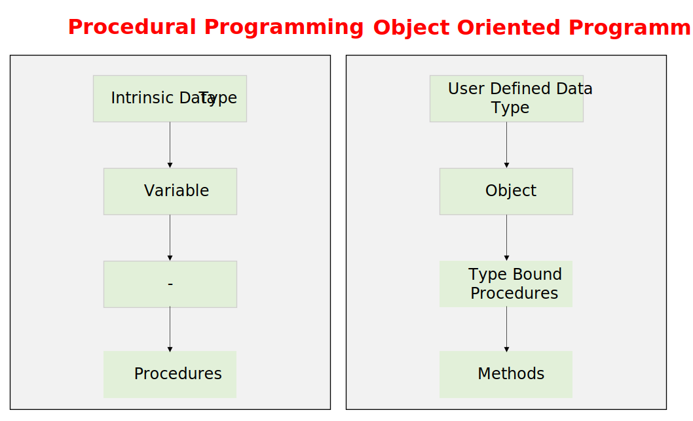
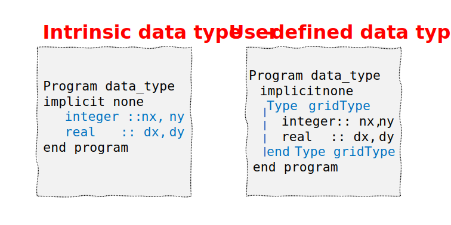
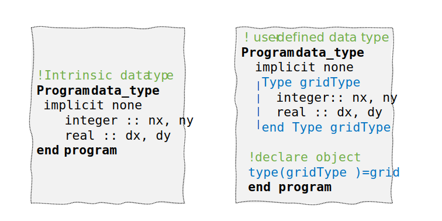
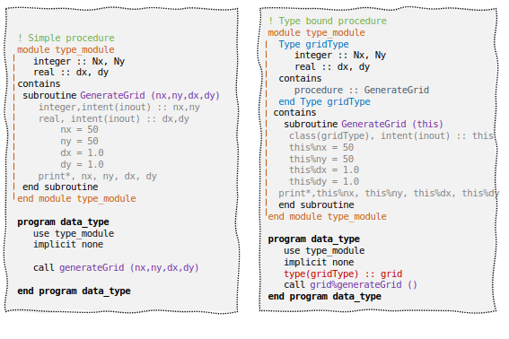
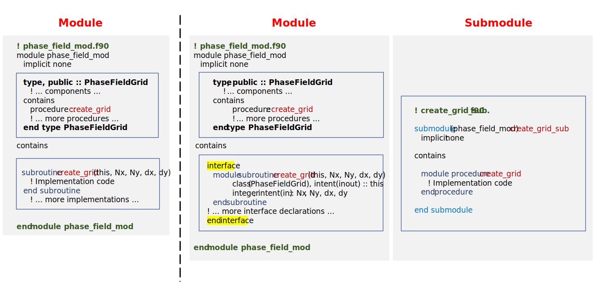

# Object-Oriented Phase Field Method with Fortran

This repository demonstrates the implementation of the phase field methods using modern

*   Fortran's Object-Oriented Programming (OOP) features
*   submodule architecture. 

The code simulates microstructure evolution for the model A, model B and model C phase field methods.


## 1. Procedural vs Object-Oriented Programming

In [procedural programming](https://github.com/Shahid718/Fortran-Phase-field-codes-using-Internal-Procedures), we work with **intrinsic data types** such as `integer`, `real`, `complex`, `character`, and `logical`. These are the fundamental building blocks provided by the language. In contrast, object-oriented programming allows us to define **user-defined types** using the type construct, which can group multiple components of any type into a single structure.

In procedural programming, we use **variables** that hold values of intrinsic types. In object-oriented programming, we create **objects** which are instances of user-defined types. An object contains all the data components defined in its type, and it has direct access to them through the object reference.

For procedures, procedural programming uses standalone subroutines and functions that are independent of any particular data type. These procedures must explicitly receive all required data through arguments. In object-oriented programming, procedures are bound to types and are called **methods**. These methods are declared inside the type definition and automatically have access to the object's data through a reference to the instance (typically called this or self).



### **Core Concepts**

Below we explain the fundamental concepts of the OOP.

**(a) Type Definition**

A data type defines the structure and properties of data that variables can hold. In Fortran, you can create **user defined** data types using the Type construct.



*   This defines a user defined data type named `grid` that contains:
*   Two integer components: `Nx` and `Ny` (grid dimensions)
*   Two real components: `dx` and `dy` (grid spacing)


**(b) Object:**

An object is a specific instance of a `class` (or `type`) that exists in memory during program execution. It bundles together related data `(attributes)` and the procedures `(methods)` that operate on that data into a single, self-contained entity. Each object maintains its own state, meaning it has its own values for the data components defined in its type. Objects represent concrete entities in the program that can receive messages (method calls) and respond by performing operations or returning information.



Here, `grid` is an `object` of the grid data type, containing its own copies of `Nx`, `Ny`, `dx`, and `dy`.

**(c) Type-Bound Procedures**

Type-bound procedures are subroutines or functions that are attached directly to a data type. They are also called **methods** in object-oriented programming. These procedures operate specifically on instances of that type.



**Key Elements:**

|Element      			|	Purpose                     |
|------------------------|------------------------------|
| `this` argument	    | References the specific instance being used |
| `class(gridType)`	    | Allows polymorphic behavior 
| `intent(inout)`	    | The instance will be modified
| `%` operator        |	Accesses components of the instance
|`call grid%generateGrid ()`|Calling the Type-Bound Procedure 

## The Complete Picture

The code example demonstrates modern Fortran OOP by:

* Defining a custom data type `gridType` that encapsulates grid-related data

* Binding a procedure `GenerateGrid` directly to the type for clean object-oriented syntax

* Using polymorphic declarations `class(gridType)` instead of `type(grid)` to enable inheritance

* Calling methods with object-oriented syntax `grid%GenerateGrid(...)`

## 2. Submodule Architecture

Submodules are a **Fortran2008+** feature that allows splitting large modules into separate files while maintaining a clean interface.




**Advantages:**

| Feature |	Benefit   |
|---------|-----------|
Separate Compilation	| Faster compile times
Interface Separation	| Clean public interfaces
Incremental Development	| Modify implementations without rebuilding entire project
Reduced Dependencies	| Changes in implementation don't affect dependent code


## Submodule Structure

**Parent Module** `(phase_field_mod.f90)`:

* Defines the `type`
* Declares procedure interfaces

**Implementation is separate**

*   `Submodule (create_grid_sub.f90)`:
*   Contains the actual implementation
*   Uses `submodule (phase_field_mod)` syntax
*   Implements `module procedure`


## Building with Fortran Package Manager (FPM)

[FPM](https://fpm.fortran-lang.org/) is the modern Fortran package manager that simplifies building, testing, and managing dependencies.

**Advantages of FPM**

| Feature  |	Benefit  |
|----------| ------------|
Simple Build System	 | No more complex Makefiles
Dependency Management|	Automatic handling of module dependencies
Cross-Platform	     |Works on Linux, macOS, Windows
Package Registry	 | Easy integration with other libraries


## Repository Structure

```text
model_/
│
├── app/
│   └── main.f90                      # Main program
│
├── src/
│   ├── phase_field_mod.f90           # Main module with type definition
│   │
│   ├── create_grid_sub.f90           # Submodule: 
│   ├── ...                           # Submodule: 
│   ├── ...                           # Submodule: 
│   └── output_results_sub.f90        # Submodule: Results output
│
├── fpm.toml                          # Fortran Package Manager file
│
├── README.md                         # This file
│
├── LICENSE                           # License file
│
├── .gitignore                        # Git ignore file
│
└── data/
    └── (simulation output files)
```
## Why Object-Oriented Programming for Phase Field Methods?

**Scientific Computing Challenges**

Phase field methods are computationally intensive and involve complex physical phenomena:

*   **Multiple interacting fields:** Phase variables, concentrations, temperature, stress
*   **Nonlinear partial differential equations:** Allen-Cahn, Cahn-Hilliard
*    **Complex geometries:** Dendrites, grain boundaries, multi-phase systems
*   **Multiple scales:** Nano to macro, microsecond to hour timescales

## OOP Advantages 


| Challenge	| OOP Solution |
|-----|-------------|
|Code complexity	| Encapsulation groups related data and methods
Model variations	| Inheritance allows extending base models
Parameter management |	Objects maintain their own state
Code reuse	| Components can be reused across projects
Collaborative development |	Clear interfaces and modular structure
Testing and debugging	 | Isolated components, easier testing

## Benefits for Phase Field Applications

**Modular Physics:** Different driving forces (chemical, thermal, mechanical) can be plugged in

**Extensible Materials:** New material models inherit from base classes

**Flexible Numerics:** Different solvers can be swapped without changing physics

**Reproducible Research:** Clear, maintainable code enables scientific reproducibility

## Conclusion

This project demonstrates the power of modern Fortran for scientific computing through:

*   **Object-Oriented Programming:** Clean, maintainable code
*   **Submodule Architecture:** Organized, modular structure
*   **Package Management:** Simplified building and dependencies
*   **Scientific Applications:** Real-world phase field simulations

The combination of these modern Fortran features enables:

*   **Efficient Development:** Faster coding and debugging
*   **Code Reuse:** Components can be shared across projects
*   **Scalability:** Easy to add new physics and algorithms
*   **Reproducibility:** Clear, well-documented code

## Contact

In case, you find issues to report or having trouble using the codes, you may contact via email

shahid@njust.edu.cn

**Date : 17 June 2026**
